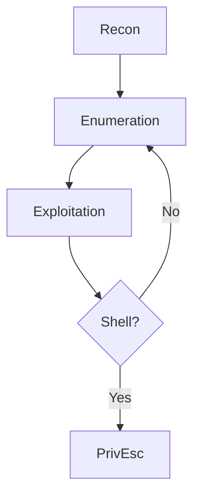

# OSCP - Machine: 10.10.10.10

## 🎯 Quick Info
**IP:** 10.10.10.10  
**OS:** Linux Ubuntu 18.04  
**Difficulty:** Medium  
**Owned:** ✅ Yes  
**Time:** 3 hours  

## 🔍 Reconnaissance

### Port Scan Results
```bash
nmap -sC -sV -oA nmap/initial 10.10.10.10

---
## 🔧 **Tools to Enhance Your Notes:**
1. **Typora** or **Obsidian** - Beautiful Markdown editors
2. **Mermaid** (GitHub supports it) - For diagrams:

